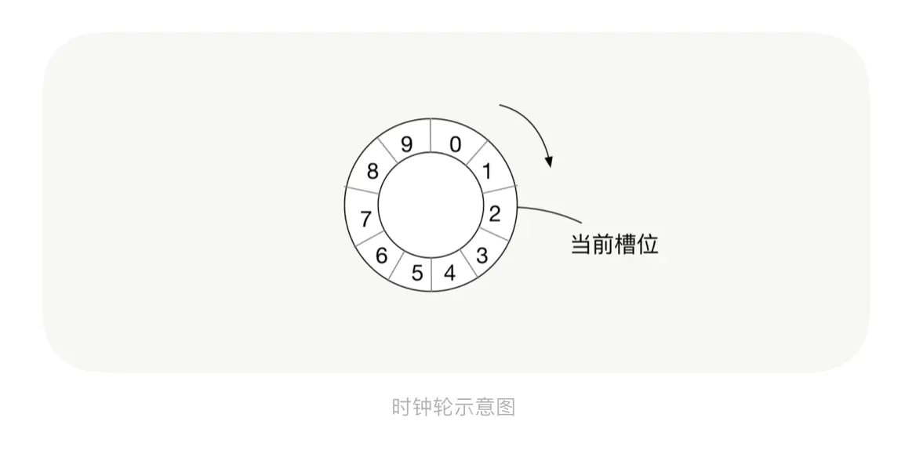

### TimingWheel(单层时间轮) v1.0

#### `时间轮延时任务处理器`
#### `20220823`



```
func main() {
    //创建时间轮
    timingWheel := CreateTimingWheel(1*time.Second, 60, func(data interface{}) {
        fmt.Printf("%+v\n", data)
    })
    //启动时间轮
    timingWheel.Running()
    
    task1 := Task{key: "111", delay: 20, info: "111"}
    timingWheel.AddTask(task1)
    
    task2 := Task{key: "222", delay: 21, info: "222"}
    timingWheel.AddTask(task2)
    
    task3 := Task{key: "333", delay: 65, info: "222"}
    timingWheel.AddTask(task3)
    
    //删除任务
    timingWheel.DelTask("222")
    
    //休眠5秒再添加一个不延时的任务
    time.Sleep(5 * time.Second)
    task4 := Task{key: "444", delay: 0, info: "111"}
    timingWheel.AddTask(task4)
    select {}
}
```
